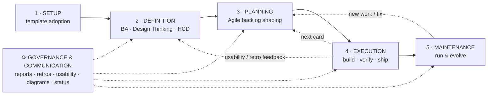

# Project Lifecycle

How this template's skills, agents, and gates map onto a project's lifecycle — written from a
project-management / business-analysis perspective. It complements [`CLAUDE.md`](../CLAUDE.md)
(the *pipeline order*) by giving the *phase view*: what each stage is for, what it produces, and
**how strongly it's enforced**.

> Read alongside the two enforcement layers — [agents](../.claude/agents/) (least-privilege
> envelope) and [hooks](../.claude/settings.json) (hard gates) — described at the bottom.

---

## The shape

Five phases on a spine, plus one cross-cutting **Governance & Communication** band that runs the
whole time. The middle phases **iterate** — Planning ⇄ Execution loops every sprint, and feedback
(retro, usability) can re-open Definition.

---

## 1 · Setup — *template adoption / initiation*

Stand up the engineering environment. One-time.

| Skill | Role | Produces |
|---|---|---|
| `/setup` | Detect stack (or **recommend one on greenfield** from the PRD's constraints), interview for gaps, fill operational config | `.claude/context.md`, `stack-profile.sh`, scripts, greenfield stack ADR |
| `/code-map` | Generate the router index read by `/planner` & `/locate` | `.claude/code-map.md` |
| `/visual-setup` | *Opt-in* — scaffold visual baseline review (Tier 1 Playwright · Tier 2 + Storybook · Tier 3 + review app) | visual config |

**Enforcement:** soft. Skills fill the config; nothing blocks an incomplete setup, but downstream
gates read this config, so gaps surface later.

## 2 · Definition — *business analysis · Design Thinking · HCD*

Understand the problem, the user, and the shape of the solution — the **problem space**, before a
backlog exists.

| Skill | Role | Produces |
|---|---|---|
| `/discovery` | Iterative requirements / PRD / HCD interview → **PRD** with INVEST stories | `PRODUCT.md`, `docs/discovery/<slug>.md` |
| `/design-import` | Design → spec via Google Stitch (tokens, layout, typography) | `DESIGN.md`, `docs/design/<slug>.md` |

**Personas (HCD):** `PRODUCT.md` holds the **persona index** (Persona · JTBD · why · profile link),
and each persona the product keeps designing for gets a full profile under `docs/personas/<slug>.md`
— jobs-to-be-done, goals, pains/gains, context, and a scenario — written by `/discovery`. The index
stays lean; the doc holds the depth. `/planner` validates every task's User-value persona against the
index (a persona must exist before a task can reference it).

**Enforcement:** soft (skill-guided). Definition quality is convention, not machine-checked.

## 3 · Planning — *Agile backlog shaping*

Turn the PRD into a shaped, ready backlog — the **solution space**.

| Skill | Role | Produces |
|---|---|---|
| `/story-map` | User journey → release slices; flags journey gaps (`⚠️ GAP — no roadmap task`) | `docs/story-map.md` |
| `/planner` | User stories → roadmap tasks with full DoR; reads the code map first | `docs/ROADMAP.md` |
| `/locate` | Coarse impact scoping for change-type tasks (saved into the card) | change-set in the card |
| `/sprint-start` | Sprint kickoff — hard DoR gate on every planned task | — |

**Story map ↔ sprint ↔ task (bidirectional):** every task carries a **`Journey:` coordinate**
(`<activity> / <step>`, or `N/A` for infra/tooling). `/story-map` reconciles the map against the
roadmap **both ways** and emits a coverage matrix — a journey step with no task is a `⚠️ GAP`, a task
whose coordinate matches no step (or is missing) is a `⚠️ ORPHAN`/`UNMAPPED`. It still cannot create
or edit tasks — GAPS and orphans are handed to `/planner`. Release slices ≠ sprints (a slice is a
journey cut). The `Journey` coordinate and a known persona are both **DoR items**.

**Task dependencies:** first-class. `/planner`'s **Dependencies** field (task IDs) is required by
DoR. `/ship-task open` is dependency-gated + priority-ordered (P0→P1→P2, then ID): it skips a task
until every dependency is delivered `[x]`. A task shipped-but-unmerged in the same run doesn't
count as satisfied until merged.

**Enforcement:** **DoR is a hard gate** (checked by `/sprint-start` and `/start-task`), but it's
skill logic, not a hook — the machine block happens at the Execution boundary.

## 4 · Execution — *iterative delivery: build · verify · ship*

Deliver each card as a reviewed, tested increment. Orchestrated end-to-end by **`/ship-task`**.

| Stage | Skills |
|---|---|
| Gate | `/start-task` — DoR check, branch, writes `.current-task` |
| Build (TDD) | `/schema-agent` → `/test-writer` (RED) → `/locate` (precise) → `/coder` → `/test-writer` (GREEN) |
| Review (report-only) | `/ux-review` · `/perf-review` · `/perf-measure` · `/security-audit` · `/dep-audit` · `/qa-tester` · `/visual-review` |
| Validate (HCD) | `/usability-test` — heuristic eval + real-user protocol + synthesis |
| Document | `/docs` · `/diagram` |
| Ship | `/commit` → `/pr-reviewer` (DoD gate, opens PR) |

**Test layers** (`/test-writer`): unit → component (Testing Library/jsdom) → integration (real DB)
→ E2E (Playwright) → axe accessibility (`vitest-axe` / `@axe-core/playwright`).

**UAT — two distinct things:**
- `/qa-tester` performs **automated acceptance verification** in a browser (`/webapp-testing`
  Playwright), screenshots to `.scratch/uat/`. It explicitly does **not** claim UAT passed — only
  "acceptance criteria verified."
- **True UAT is a human** accepting the feature at the PR (`/pr-reviewer` → Human UAT). Visual
  baseline changes are parked as *pending* until a human approves them.

**Enforcement:** **strong (hard hooks, fail-closed).** No edit to `src/`/`tests/`/schema without an
active task that exists in the roadmap on the correct branch; no commit to `main`; Conventional
Commits required; only `/pr-reviewer` may push. Reviewers have no Edit/Write tools — an auditor
can't edit the code it audits.

## 5 · Maintenance — *run & evolve*

Post-delivery: fixes, tech debt, drift. Bugs are first-class roadmap work.

| Skill | Role |
|---|---|
| `/debugger` | `Type: Fix` cards — reproduce, root-cause, minimal fix |
| `/dep-audit` | Ongoing SCA — vulnerable / outdated dependencies |
| `/refactor` | Behaviour-preserving cleanup, guarded by green tests |
| `/perf-measure` | Regression checks against budgets |
| `/roadmap-status` | Track progress, archive delivered blocks |

**Enforcement:** strong — a bug fix must exist as a roadmap card (`Type: Fix`) *before* any code,
with **no exception for fixes** in the roadmap-gate hook.

---

## ⟳ Cross-cutting — Governance, Communication & Continuous Improvement

Runs across all five phases (this is where reports / retros / presentations live — they *steer and
close*, they don't *shape the backlog*).

| Skill | Role | PM lens |
|---|---|---|
| `/report` | Progress report + branded deck (PPTX/PDF/illustrated) | Stakeholder comms / status reporting |
| `/retro` | Sprint retrospective → action items feed `/planner` | Closing + continuous improvement |
| `/usability-test` | HCD validation → improvements feed `/planner` | Validation loop |
| `/diagram` | Mermaid ERD / architecture / sequence / flow visuals | Communication artifacts |
| `/roadmap-status` | Status, done-marking, archiving | Monitoring & controlling |

---

## The enforcement gradient (summary)

The single most important thing for a BA/PM to understand about this pipeline:

| Phase | Enforcement | Mechanism |
|---|---|---|
| Setup | Soft | skill fills config; downstream reads it |
| Definition | Soft | skill discipline; DoR requires persona/JTBD |
| Planning | **Hard gate on DoR** | `/sprint-start`, `/start-task` logic |
| Execution | **Hard, fail-closed** | PreToolUse hooks (roadmap/branch/commit/push) + least-privilege agents |
| Maintenance | **Hard** | roadmap gate, no fix exception |

**The machine guarantees *no code without a ready card on the right branch, reviewed before it
ships*. It does not guarantee the analysis behind the card was good — that still depends on running
the Definition and Planning skills with rigor.**

### Two layers underneath

- **Agents** (`.claude/agents/`) — the *envelope*: least-privilege tools + right-sized model per
  role. Reviewers can't edit; `/locate`, `/visual-review`, `/code-map` are read-only; only
  `/pr-reviewer` pushes. Opus for hard builders/auditors, Sonnet for reviewers, Haiku for cheap
  routing.
- **Hooks** (`settings.json` + `stack-profile.sh`) — the *backstop*: hard PreToolUse blocks +
  PostToolUse warnings. All stack-specific patterns live in `stack-profile.sh`, so retargeting a
  stack means editing one file.

### Knowledge tiers feeding it all

`PRODUCT.md` (Definition) → `ROADMAP.md` + `story-map.md` (Planning) → `ARCHITECTURE.md` +
`.claude/code-map.md` (Execution). A fact lives in exactly one tier.
